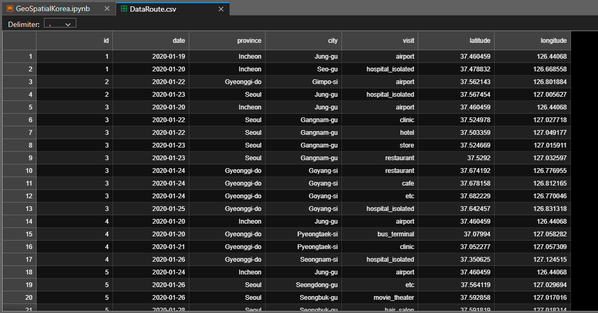
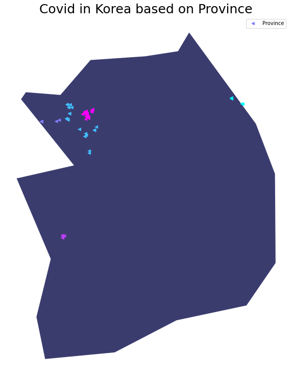

# South Korea geospatial analysis

South Korea geospatial analysis wih route dataset.

>The dataset used is the transportation route and shape from South Korea. This analysis aims to find out which provinces have a lot of travel activities during the Covid-19 pandemic.

Here's a quick look at the dataset I'm using:

  

The libraries used are as follows:
- numpy
- pandas
- matplotlib
- seaborn

The following is a peek at the visualization result of the analysis:

  
